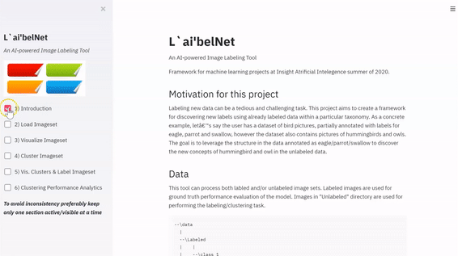

<p align="left">   </p>

# L`ai'belNet 
              
An AI-powered Image Labeling Tool

<p align="center">
  
</p>

## Introduction
Labeling images is an initial and essential step in training computer vision algorithms.  This has offered great business opportunities. Image labeling is currently conducted mostly manually, and companies are actively looking for methods to accelerate this process and make it faster, cheaper, more profitable. 
In this project, I am proposing an unsupervised approach to label image data for computer vision based on common clustering methods.

**_L`ai'belNet_** is a Steamlit app and uses either KMeans or Gaussian Mixture Model based on user's choice to cluster imageset into groups of more similar images. User can specify the number of clusters or have the app find the optimum number of clusters. Next a few samples from each cluster is randomly selected so user can discover their labels. Finally, all the images of each cluster are labeled with the cluster's respective label discovered via sampling. 

## Data
**_L`ai'belNet_** allows user to provide path to the image directory, e.g., _"\data"_ in this repository. All the image type files contained in the path directory and its sub-directories will be imported and their paths are saved. The immediate directory where an image is found can be considered as Ground Truth label of the image by user's choice and will be used (if availabel) for the application's performance evaluation. A sample of [Intel Kaggle competition](https://www.kaggle.com/puneet6060/intel-image-classification) is included in this repository.

```
--\data
  |    |  
  |    --\class 1
  |    |  (images)
  |    --\class 2
  |    |  (images)
  |    |... 
  |    |...  
  |    |...  
  |    --\class n
  |       (images)
  -- (images)

```

## Motivation for this project format:
- **Insight_Project_Framework** : Put all source code for production within structured directory
- **tests** : Put all source code for testing in an easy to find location
- **configs** : Enable modification of all preset variables within single directory (consisting of one or many config files for separate tasks)
- **data** : Include example a small amount of data in the Github repository so tests can be run to validate installation
- **build** : Include scripts that automate building of a standalone environment
- **static** : Any images or content to include in the README or web framework if part of the pipeline

## Setup
To run locally, clone this repository:
```
repo_name=Insight_Project_Framework # URL of your new repository
username=mrubash1 # Username for your personal github account
git clone https://github.com/$username/$repo_name
cd $repo_name
echo "export $repo_name=${PWD}" >> ~/.bash_profile
echo "export PYTHONPATH=$repo_name/src:${PYTHONPATH}" >> ~/.bash_profile
source ~/.bash_profile
```
Create new development branch and switch onto it
```
branch_name=dev-readme_requisites-20180905 # Name of development branch, of the form 'dev-feature_name-date_of_creation'}}
git checkout -b $branch_name
```

## Initial Commit
Lets start with a blank slate: remove `.git` and re initialize the repo
```
cd $repo_name
rm -rf .git   
git init   
git status
```  
You'll see a list of file, these are files that git doesn't recognize. At this point, feel free to change the directory names to match your project. i.e. change the parent directory Insight_Project_Framework and the project directory Insight_Project_Framework:
Now commit these:
```
git add .
git commit -m "Initial commit"
git push origin $branch_name
```

## Requisites

- List all packages and software needed to build the environment
- This could include cloud command line tools (i.e. gsutil), package managers (i.e. conda), etc.

#### Dependencies

- [Streamlit](streamlit.io)

#### Installation
To install the package above, pleae run:
```shell
pip install -r requiremnts
```

## Build Environment
- Include instructions of how to launch scripts in the build subfolder
- Build scripts can include shell scripts or python setup.py files
- The purpose of these scripts is to build a standalone environment, for running the code in this repository
- The environment can be for local use, or for use in a cloud environment
- If using for a cloud environment, commands could include CLI tools from a cloud provider (i.e. gsutil from Google Cloud Platform)
```
# Example

# Step 1
# Step 2
```

## Configs
- We recommond using either .yaml or .txt for your config files, not .json
- **DO NOT STORE CREDENTIALS IN THE CONFIG DIRECTORY!!**
- If credentials are needed, use environment variables or HashiCorp's [Vault](https://www.vaultproject.io/)


## Test
- Include instructions for how to run all tests after the software is installed
```
# Example

# Step 1
# Step 2
```

## Run Inference
- Include instructions on how to run inference
- i.e. image classification on a single image for a CNN deep learning project
```
# Example

# Step 1
# Step 2
```

## Build Model
- Include instructions of how to build the model
- This can be done either locally or on the cloud
```
# Example

# Step 1
# Step 2
```

## Serve Model
- Include instructions of how to set up a REST or RPC endpoint
- This is for running remote inference via a custom model
```
# Example

# Step 1
# Step 2
```

## Analysis
- Include some form of EDA (exploratory data analysis)
- And/or include benchmarking of the model and results
```
# Example

# Step 1
# Step 2
```
